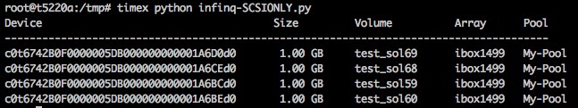

# infinq

## INQ Utility for Solaris

### Background
InfiniBox volumes can be inquired using the HPT 'infinihost volume list' command. due to architecture limitation, it works very slow on Sun Solaris Sparc hosts.
The Following utility can be used to query all SCSI devices, and uses SCSI queries to get the required data.
infinq supports multipathed devices and both iSCSI and FC connectivity.

### Prerequisites
* Python 2.7.x. need to be installed
* sg3_utils has to be installed - can be downloaded from [here](https://github.com/hreinecke/sg3_utils)

### Sample Output 

### Limitations
tested with 1,000 InfiniBox devices
 

